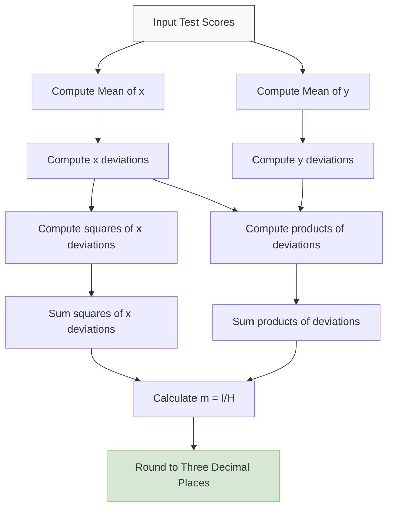

# Correlation and Regression Lines

## Project Overview
This project demonstrates how to calculate the slope of a regression line from a dataset of student test scores. Understanding correlation and regression is fundamental in data analysis for examining relationships between variables.

## Problem Statement
Given the test scores of 10 students in Physics and History, compute the slope of the regression line obtained by treating Physics as the independent variable. The result should be rounded to three decimal places.

## Dataset
The analysis uses the following test scores from 10 students:

| Student | Physics (x) | History (y) |
|---------|------------|-------------|
| 1       | 15         | 10          |
| 2       | 12         | 25          |
| 3       | 8          | 17          |
| 4       | 8          | 11          |
| 5       | 7          | 13          |
| 6       | 7          | 17          |
| 7       | 7          | 20          |
| 8       | 6          | 13          |
| 9       | 5          | 9           |
| 10      | 3          | 15          |

## Mathematical Formulation

### Slope of a Regression Line
The slope of the regression line is calculated using the following formula:

$$m = \frac{\sum_{i=1}^{n}(x_i-\bar{x})(y_i-\bar{y})}{\sum_{i=1}^{n}(x_i-\bar{x})^2}$$

Where:
* $m$ is the slope of the regression line
* $x_i$ and $y_i$ are the data points
* $\bar{x}$ and $\bar{y}$ are the means of the $x$-values and $y$-values, respectively
* $n$ is the number of data points

### Visual Representation

### Conceptual Workflow

## Expected Output Format
The answer should be provided as a floating-point decimal value rounded to three decimal places, without any leading or trailing spaces.

Example format: `0.255`

## Implementation Notes
1. Calculate the mean of both Physics and History scores
2. For each data point, compute the deviations from the mean
3. Calculate the products of deviations and the squares of x-deviations
4. Sum these values and apply the formula
5. Round the final result to three decimal places

## Significance
Understanding the relationship between Physics and History scores through correlation and regression analysis can provide insights into:
- The strength and direction of the relationship between the two subjects
- How performance in Physics (independent variable) might relate to performance in History (dependent variable)
- The slope coefficient as a measure of how much History scores change, on average, for each unit change in Physics scores
- The potential predictive value of using Physics scores to estimate History performance

---

**Note**: This document outlines the methodology for calculation. The actual implementation can be done using various programming languages or statistical software.
